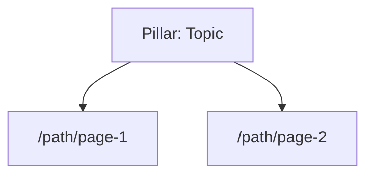

# Keyword Research Report: [TOPIC]

**Date**: [YYYY-MM-DD]
**Input Type**: [Keyword / URL / Codebase Directory]
**Input Value**: [user's original input]
**Language**: [Auto-detected]

---

## Executive Summary

- **Market Assessment**: [Brief 1-line assessment of the keyword landscape]
- **Top Opportunity**: [Single best keyword opportunity identified]
- **Key Finding**: [Most surprising or actionable insight]
- **Recommended Focus**: [Primary content strategy direction]
- **Data Confidence**: [High (API data) / Medium (heuristic + Trends) / Low (heuristic only)]

---

## 1. Seed Discovery

### Input Analysis

[Description of how seeds were extracted from the input]

### Seed Keywords

| #   | Seed Keyword | Source | Notes |
| --- | ------------ | ------ | ----- |
| 1   |              |        |       |

### Current Page Inventory

Existing pages discovered from sitemap.xml or codebase scan.

| Category      | URL Pattern              | Count   | Examples |
| ------------- | ------------------------ | ------- | -------- |
| Homepage      | `/`                      |         |          |
| Blog posts    | `/blog/*`                |         |          |
| Tool pages    | `/tools/*`               |         |          |
| Alternatives  | `/alternatives/*`        |         |          |
| Use cases     | `/use-cases/*`           |         |          |
| Feature pages | `/features/*`            |         |          |
| Product pages | `/stock/*`, `/product/*` |         |          |
| Legal/support | `/privacy`, `/terms`     |         |          |
| **Total**     |                          | **[N]** |          |

> All recommendations in Section 6 will be cross-checked against this inventory:
> `[✅ Already exists: /path]` or `[🆕 New page needed]`

---

## 2. SERP Landscape

### Seed: "[Primary Seed Keyword]"

#### Top 5 Organic Results

| #   | Title | URL | Content Type | Est. Word Count |
| --- | ----- | --- | ------------ | --------------- |
| 1   |       |     |              |                 |

#### SERP Features Detected

- [ ] Featured Snippet
- [ ] People Also Ask
- [ ] Video Pack
- [ ] Image Pack
- [ ] Local Pack
- [ ] AI Overview
- [ ] Ads (count: \_\_\_)

#### People Also Ask Questions

1.
2.
3.

#### Related Searches

1.
2.
3.

### Competitor Sitemap Analysis

| Competitor      | Total SEO Pages | Blog | Tools | Alternatives | Use Cases | Other |
| --------------- | --------------- | ---- | ----- | ------------ | --------- | ----- |
| competitor1.com |                 |      |       |              |           |       |
| competitor2.com |                 |      |       |              |           |       |
| competitor3.com |                 |      |       |              |           |       |

#### Content Gap Matrix

Pages competitors have that you do NOT:

| Gap Type | Competitor Has               | You Have? | Priority | Recommended Action       |
| -------- | ---------------------------- | --------- | -------- | ------------------------ |
|          | `/alternatives/[competitor]` | ❌        | High     | Create alternatives page |
|          | `/tools/[free-tool]`         | ❌        | High     | Build free tool page     |
|          | `/blog/[topic]`              | ❌        | Medium   | Write blog post          |

### Competitor Traffic & Revenue Estimation

| Competitor | Est. Monthly Traffic | Indexed Pages | Pricing | Est. Conversion | Est. MRR |
| ---------- | -------------------- | ------------- | ------- | --------------- | -------- |
|            |                      |               |         |                 |          |

> ⚠️ Traffic and revenue figures are `[estimated]` based on SimilarWeb free tier,
> SERP position heuristics, and public pricing data. Verify with paid tools for precision.

### Competitor Feature Matrix

| Competitor | AI Analysis | Fundamental (Graham) | Technical (Wyckoff) | Screenshot Upload | Free Tier | Threat Level |
| ---------- | ----------- | -------------------- | ------------------- | ----------------- | --------- | ------------ |
|            |             |                      |                     |                   |           |              |

> Fill columns with ✅/❌/Partial. This matrix visualizes your unique positioning at a glance.

---

## 3. Full Candidate Keyword List

| #   | Keyword | Intent | Rel. Volume | KD (0-100) | Trend | Cluster | Source |
| --- | ------- | ------ | ----------- | ---------- | ----- | ------- | ------ |
| 1   |         |        |             |            |       |         |        |

---

## 4. Google Trends Insights

### Trend Comparison (Top 5 Keywords)

| Keyword | 12-Month Trend | Peak Month | Regional Leader |
| ------- | -------------- | ---------- | --------------- |
|         |                |            |                 |

### Seasonal Patterns

[Any recurring patterns noted]

### Rising Related Queries

| Query | Growth | Opportunity |
| ----- | ------ | ----------- |
|       |        |             |

---

## 5. Topic Clusters

### Cluster 1: [Pillar Topic Name]

- **Pillar Keyword**: [keyword] (Volume: **_, Difficulty: _**)
- **Supporting Keywords**:
  - [keyword 1]
  - [keyword 2]
- **Related Keywords** (for internal linking):
  - [keyword 1]

### Cluster 2: [Pillar Topic Name]

[Same structure]

---

## 6. SEO Optimization Strategy & Action Plan

This section provides a prioritized, data-backed blueprint for ranking success.

| Category      | Action | Rationale (The "Why") | ICE (I/C/E) | Leader to Beat | Status |
| ------------- | ------ | --------------------- | ----------- | -------------- | ------ |
| **Homepage**  |        |                       |             |                | [ ]    |
| **Blog**      |        |                       |             |                | [ ]    |
| **Tools**     |        |                       |             |                | [ ]    |
| **Pillar**    |        |                       |             |                | [ ]    |
| **Technical** |        |                       |             |                | [ ]    |

> **Notation**: **ICE Score** = (Impact + Confidence + Ease) / 3. Score 1-10.
> **Leader to Beat**: The current #1 ranking site for this specific sub-topic or keyword.

### 📝 TDK & Content Blueprints (Quick Execution)

For the highest-ICE priorities, here are the ready-to-use TDK (Title, Description, Keyword) drafts.

| Page / Target | Target Title Tag | Meta Description Draft | Primary LSI Keywords |
| ------------- | ---------------- | ---------------------- | -------------------- |
|               |                  |                        |                      |

### 🏗️ Site Architecture Map (Pillar + Cluster)

> ⚠️ **Mermaid Syntax Rule**: Always wrap labels containing `/` or special characters in double quotes.
> Example: `C1["/tools/calculator"]` NOT `C1[/tools/calculator]`

---

## 7. Strategic Content Briefing (For Writers)

This section provides actionable blueprints for the top priority pages.

### Brief 1: [Target Keyword]

| Component                   | Specification                                                |
| --------------------------- | ------------------------------------------------------------ |
| **Proposed URL**            | `/blog/[slug]`                                               |
| **Primary Keyword**         |                                                              |
| **Proposed Title**          |                                                              |
| **Search Intent**           |                                                              |
| **Headline Structure**      | **H1**: TITLE **H2**: Subtopic **H3**: Detail          |
| **NLP Keywords**            | [List of related terms]                                      |
| **Entities to Mention**     | [Specific people, brands, or entities to include]            |
| **Featured Snippet Action** | [Action to target Position Zero, e.g., Definition Paragraph] |
| **Competitor Angle**        | [Gaps found in SERP]                                         |
| **CTA Strategy**            | [Recommended product link/action]                            |

---

## 8. Content Calendar (First 3 Months)

A phased publishing schedule aligned to the prioritized keyword clusters.

### Month 1: Foundation

| Week | Content | Target Keyword | Type | ICE |
| ---- | ------- | -------------- | ---- | --- |
| W1   |         |                |      |     |
| W2   |         |                |      |     |
| W3   |         |                |      |     |
| W4   |         |                |      |     |

### Month 2: Expansion

| Week | Content | Target Keyword | Type | ICE |
| ---- | ------- | -------------- | ---- | --- |
| W5   |         |                |      |     |
| W6   |         |                |      |     |
| W7   |         |                |      |     |
| W8   |         |                |      |     |

### Month 3: Authority Building

| Week | Content | Target Keyword | Type | ICE |
| ---- | ------- | -------------- | ---- | --- |
| W9   |         |                |      |     |
| W10  |         |                |      |     |
| W11  |         |                |      |     |
| W12  |         |                |      |     |

---

## 9. Token Consumption Estimate

Estimated cost breakdown for this analysis run.

| Phase                          | Input Tokens (est.) | Output Tokens (est.) | Notes                      |
| ------------------------------ | ------------------- | -------------------- | -------------------------- |
| SKILL.md System Prompt         | ~4,000              | —                    | Loaded once at activation  |
| Phase 0: Input Processing      | ~500                | ~300                 | curl + local parse         |
| Phase 1: SERP Analysis ×[N]    | ~[N×2,000]          | ~[N×500]             | JS-extracted JSON per SERP |
| Phase 1.2: Competitor Pages ×5 | ~5,000              | ~1,500               | curl headings extraction   |
| Phase 2: Google Trends         | ~3,000              | ~800                 | Browser interaction        |
| Phase 3: Difficulty Scoring    | ~500                | ~1,500               | LLM reasoning              |
| Phase 4: Intent & Clustering   | ~500                | ~2,000               | LLM reasoning              |
| Phase 5: Prioritization        | ~300                | ~1,000               | LLM reasoning              |
| Phase 6: Report Generation     | ~500                | ~4,000               | Full report output         |
| **Total Estimated**            | **~[SUM]**          | **~[SUM]**           |                            |
| **Grand Total**                | **~[INPUT+OUTPUT]** |                      |                            |

> ⚠️ These are estimates based on content processed. Actual consumption depends on
> page size, conversation history length, and model used. Monitor usage via your API console.

---

## Appendix: Data Sources & Methodology

- **SERP Data**: Live Google Search results (date: [DATE])
- **Trend Data**: Google Trends (comparison period: 12 months)
- **Difficulty Score**: SERP-based heuristic scoring (see `references/scoring-guide.md`)
- **Volume Estimates**: Composite heuristic (Trends + Result Count + Autocomplete + Ad Presence)

> ⚠️ Volume and difficulty scores are estimates based on publicly available signals.
> For precision data, verify with Ahrefs, Semrush, or Google Keyword Planner.
